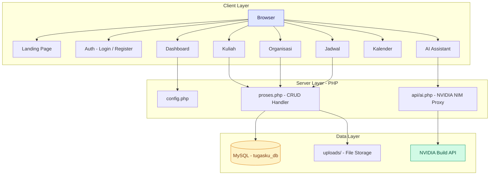
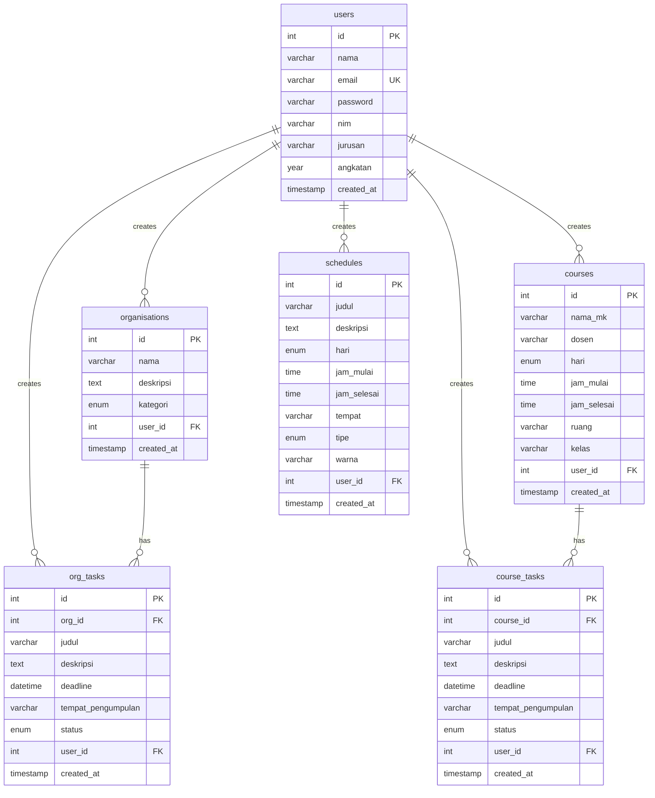
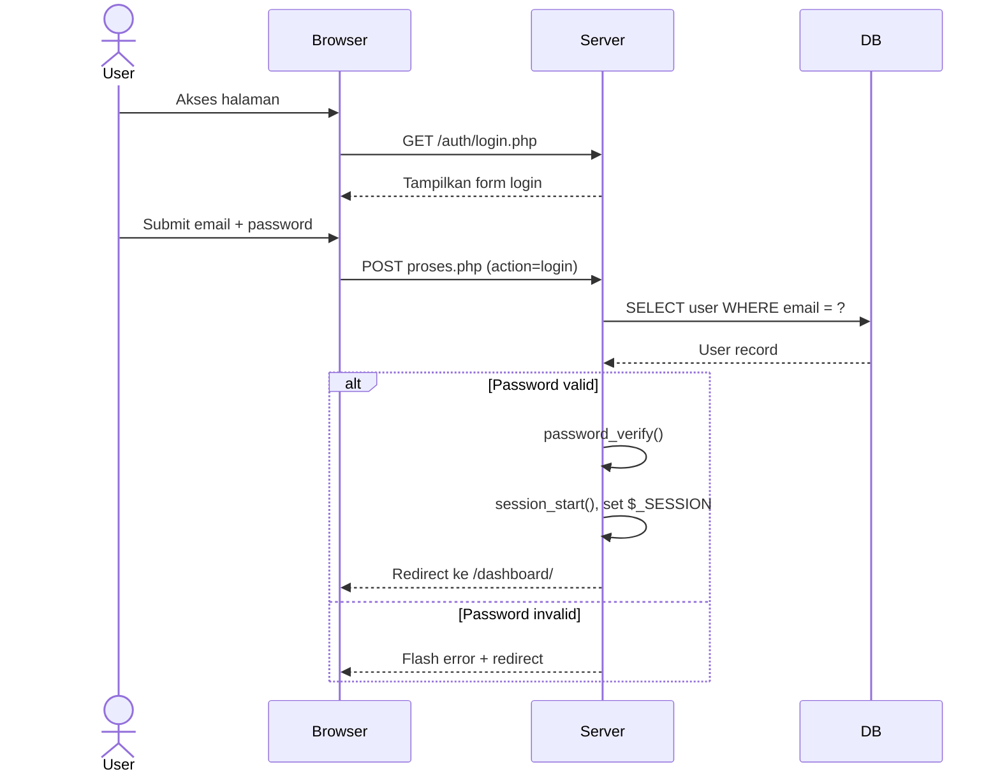
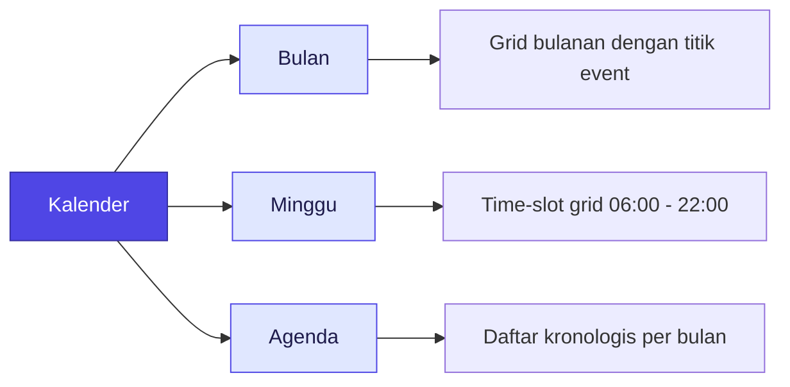

# TugasKu

**Platform Manajemen Kegiatan & Akademik Mahasiswa Modern**

TugasKu adalah platform produktivitas all-in-one yang dirancang khusus untuk mahasiswa Indonesia. Satu antarmuka untuk mengelola jadwal kuliah, tugas organisasi, jadwal mandiri, dan kalender akademik -- tanpa iklan, tanpa ribet.

---

## Arsitektur Sistem



---

## Tech Stack

| Layer | Teknologi |
|---|---|
| Backend | PHP (Vanilla, tanpa framework) |
| Database | MySQL / MariaDB |
| Server | Apache via Laragon |
| Frontend | HTML5, CSS3, JavaScript Vanilla |
| AI | NVIDIA Build API (NIM) |
| Font | Plus Jakarta Sans + Newsreader |

---

## Struktur Database



---

## Alur Autentikasi



---

## Fitur Utama

### Manajemen Kuliah
- Tambah, edit, hapus mata kuliah (nama, dosen, hari, jam, ruang, kelas)
- Dua mode tampilan: **Card View** dan **Timetable View** 7 hari
- Live search lintas mata kuliah dan nama dosen

### Manajemen Organisasi
- Kelola kegiatan UKM, Ormawa, Komunitas, atau kategori lainnya
- CRUD tugas per-organisasi dengan status: Belum, Progres, Selesai
- Badge urgensi deadline otomatis (Terlewat, Hari Ini, Besok, Aman)

### Jadwal Mandiri
- Buat jadwal belajar mandiri, hobi, atau kegiatan lain
- Color picker untuk pembedaan visual per kegiatan
- Tersusun per hari dalam seminggu

### Kalender Akademik
Tiga mode tampilan dalam satu halaman:



- Filter kategori: Kuliah, Tugas Kuliah, Organisasi, Jadwal Mandiri
- Navigasi bulan/minggu sebelumnya dan berikutnya
- Klik hari pada mode bulan untuk melihat detail event

### Ekspor Data (CSV)
Unduh seluruh data dalam format CSV dengan encoding UTF-8 BOM (kompatibel Google Sheets & Excel). Lima pilihan filter:
1. Semua Data
2. Tugas Organisasi
3. Tugas Kuliah
4. Jadwal Kuliah
5. Jadwal Mandiri

### Asisten AI
- Widget chat floating di pojok kanan bawah
- Powered by NVIDIA Build API dengan model fallback
- Quick suggestion: Prioritas Deadline, Manajemen Waktu, Draft Email Dosen, Tips Ujian
- Riwayat percakapan (6 turn terakhir)

### Fitur Tambahan
- **Onboarding Tour**: Walkthrough 5-langkah untuk pengguna baru
- **Status Sistem**: Monitor uptime dan latensi database secara realtime
- **Kebijakan Privasi**: Dokumentasi lengkap transparansi data
- **Changelog**: Riwayat rilis dan pembaruan fitur
- **Mobile Responsive**: Bottom navigation untuk smartphone
- **Flash Messages**: Notifikasi auto-dismiss dengan progress bar
- **Modal System**: Keyboard (Escape) dan overlay-click dismiss

---

## Instalasi

### Prasyarat
- PHP 7.4 atau lebih tinggi
- MySQL 5.7+ / MariaDB 10.3+
- Apache dengan mod `rewrite` aktif
- Laragon (opsional, untuk development lokal)

### Langkah Setup

```bash
# 1. Clone repository
git clone https://github.com/firdyridho/TugasKu.git

# 2. Pindahkan ke web server directory
# Untuk Laragon: C:\laragon\www\TugasKu

# 3. Import database
mysql -u root -p < database.sql

# 4. Konfigurasi koneksi database di config.php
# Sesuaikan DB_HOST, DB_NAME, DB_USER, DB_PASS

# 5. Pastikan folder uploads/ memiliki .htaccess
# (sudah termasuk dalam repository)

# 6. Buka di browser
# http://localhost/TugasKu/
```

### Konfigurasi NVIDIA AI (Opsional)

Untuk mengaktifkan fitur Asisten AI, tambahkan API key NVIDIA Build di `api/ai.php`:

```php
$apiKey = 'nvapi-your-api-key-here';
```

---

## Tampilan Antar Muka

```
Landing Page          Dashboard
+------------------+  +------------------+
|    Hero CTA      |  |   Stats Cards    |
|  Feature Bento   |  |  Today Schedule  |
|  Live Preview    |  |  Deadlines       |
+------------------+  +------------------+

Timetable View      Kalender
+------------------+  +------------------+
|  Mon Tue Wed ...  |  |  Month / Week /  |
|  Course Blocks    |  |  Agenda View     |
|  Today Highlight  |  |  Event Dots      |
+------------------+  +------------------+
```

---

## versi

| Versi | Tanggal | Ringkasan |
|---|---|---|
| 2.4 | 21 September 2026 | Ekspor CSV, Pengaturan Akun, Timetable Redesign, Onboarding Tour |
| 2.3 | 12 Agustus 2026 | Navigasi Kalender, Mobile Bottom Navigation |
| 2.2 | 28 Juli 2026 | Deadline Reminder, Dashboard Statistik |
| 2.0 | 10 Mei 2026 | Arsitektur baru, Manajemen Organisasi + Kuliah terpadu |

---

## Lisensi

Hak Cipta Dilindungi. Dikembangkan oleh **Firdy Ridho** – 2026.

---

<div align="center">

**TugasKu** -- Satu Platform, Semua Kegiatan Mahasiswa.

Dibuat dengan vanilla PHP, tanpa framework, tanpa dependency manager. Murni kode tangan.

</div>
